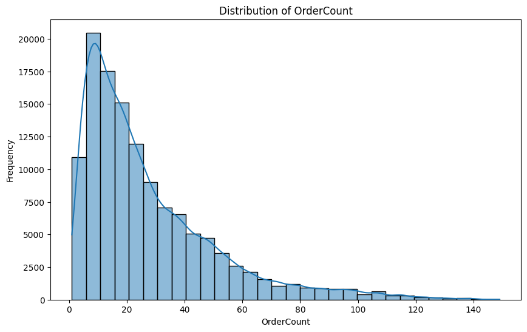
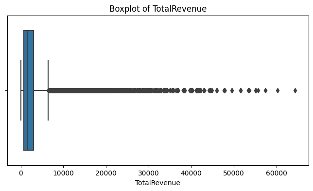
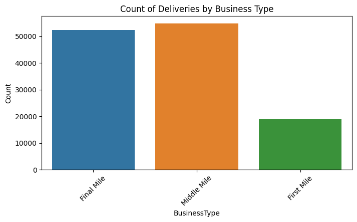
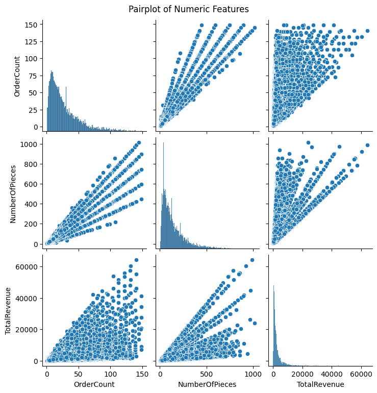
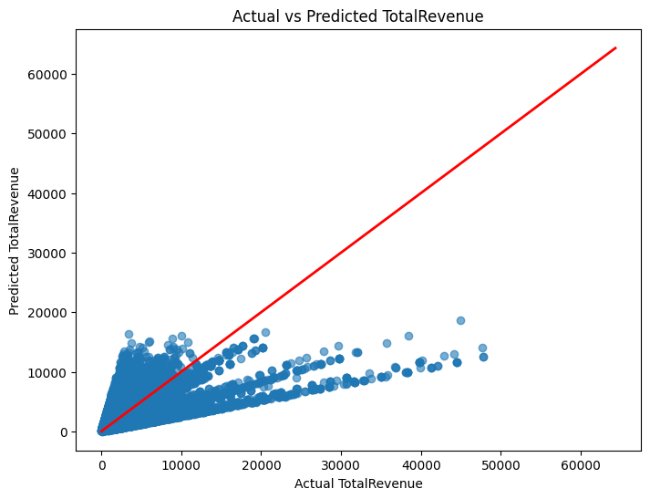

# Supply Chain Deliveries Analysis & Revenue Prediction

A data analytics and machine learning project exploring supply-chain delivery activity and predicting revenue using operational delivery data.

The project reproduces and organizes the analysis from the original Kaggle notebook into a clean, reproducible GitHub repository containing the dataset, Jupyter notebook, Python analysis script, visualizations, and original reference.

## Project Objectives

The analysis focuses on:

* Understanding the distribution of delivery activity.
* Exploring order volume, pieces, revenue, and business types.
* Identifying relationships between numerical supply-chain variables.
* Building a baseline revenue prediction model.
* Comparing actual and predicted revenue.
* Providing a reproducible Python workflow for further analysis.

## Dataset

The dataset contains **126,255 supply-chain delivery records** covering activity from **January 2020 through June 2025**.

| Field            | Description                            |
| ---------------- | -------------------------------------- |
| `WorkDate`       | Date of delivery activity              |
| `Customer`       | Customer/account                       |
| `Location`       | Operating location                     |
| `BusinessType`   | First Mile, Middle Mile, or Final Mile |
| `OrderCount`     | Number of orders                       |
| `NumberOfPieces` | Number of pieces handled               |
| `TotalRevenue`   | Revenue generated by the record        |

## Exploratory Data Analysis

### Distribution of Order Count

The distribution is strongly right-skewed. Most delivery records contain relatively small order counts, while a smaller number of observations represent substantially larger delivery volumes.



### Total Revenue Distribution

The revenue boxplot shows a strongly skewed distribution with numerous high-value observations. Most delivery records generate comparatively moderate revenue, while a smaller group represents very large revenue transactions.



### Deliveries by Business Type

Delivery activity is distributed across **Final Mile**, **Middle Mile**, and **First Mile** operations. Middle Mile and Final Mile represent the largest numbers of records in the dataset.



### Relationships Between Numeric Features

The numeric feature analysis compares:

* `OrderCount`
* `NumberOfPieces`
* `TotalRevenue`

The relationships show clear positive associations between delivery volume and number of pieces, while revenue exhibits greater variation.



## Revenue Prediction

A baseline **Linear Regression** model is used to predict `TotalRevenue`.

The predictor variables are:

```text
OrderCount
NumberOfPieces
```

The dataset is divided into training and testing subsets using an 80/20 split.

```python
X = df[["OrderCount", "NumberOfPieces"]]
y = df["TotalRevenue"]

X_train, X_test, y_train, y_test = train_test_split(
    X,
    y,
    test_size=0.2,
    random_state=42
)

model = LinearRegression()
model.fit(X_train, y_train)
```

### Actual vs Predicted Revenue

The following visualization compares actual revenue against the values predicted by the Linear Regression model.

The red diagonal represents ideal predictions. The dispersion away from this line indicates that order count and number of pieces explain part of the revenue variation but are not sufficient to capture all of the underlying revenue drivers.



## Key Findings

The analysis highlights several characteristics of the delivery data:

* Order activity is strongly right-skewed.
* Revenue contains a significant number of high-value observations and outliers.
* Middle Mile and Final Mile account for the majority of delivery records.
* Order count and number of pieces are strongly related.
* Operational volume provides useful information for revenue prediction.
* Revenue variability indicates that additional factors such as customer, location, business type, pricing, and time may improve predictive performance.

The Linear Regression model should therefore be considered a **baseline model rather than a production forecasting system**.

## Repository Structure

```text
supply-chain-deliveries-analysis/
├── data/
│   └── supply_chain_deliveries.csv
├── images/
│   └── charts/
│       ├── actual_vs_predicted_revenue.png
│       ├── business_type_count.png
│       ├── numeric_features_pairplot.png
│       ├── order_count_distribution.png
│       └── total_revenue_boxplot.png
├── notebooks/
│   └── supply_chain_analysis.ipynb
├── reports/
│   └── original_kaggle_reference.pdf
├── src/
│   └── analysis.py
├── .gitignore
├── LICENSE
├── README.md
└── requirements.txt
```

## Installation

Clone the repository:

```bash
git clone https://github.com/Ames0007/supply-chain-deliveries-analysis.git
cd supply-chain-deliveries-analysis
```

Install the dependencies:

```bash
python -m pip install -r requirements.txt
```

Run the reproducible analysis:

```bash
python src/analysis.py
```

Alternatively, open:

```text
notebooks/supply_chain_analysis.ipynb
```

with Jupyter Notebook, JupyterLab, or VS Code.

## Technologies

* Python
* Pandas
* Matplotlib
* Scikit-learn
* Jupyter Notebook
* Git & GitHub

## Original Reference

The `reports/original_kaggle_reference.pdf` file preserves the original Kaggle notebook reference associated with this analysis.

The GitHub repository organizes the analysis into a reproducible project structure with source code, data, visualizations, and documentation.

## Future Improvements

Potential extensions include:

* Customer and location features.
* Business type encoding.
* Time-based feature engineering.
* Revenue forecasting by week or month.
* Lag and rolling-window features.
* Random Forest and gradient boosting models.
* Model explainability and feature importance.
* Interactive dashboards.
* Automated testing and CI/CD.

## License

Code in this repository is released under the MIT License.

Review the original dataset terms before redistributing or reusing the source data outside this project.
